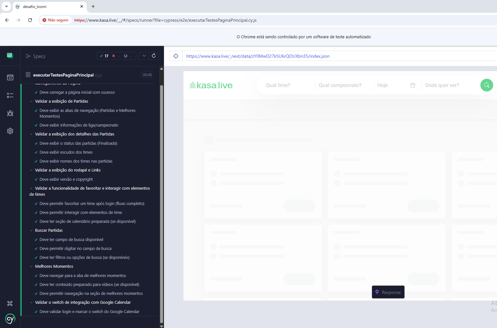

# Projeto de automação de testes para a etapa de desafio técnico

Projeto de automação de testes end-to-end para o site **Kasa.live** usando **Cypress** e **MCP Server**.

## 📋 Descrição

Este projeto implementa testes automatizados para validar as funcionalidades core da plataforma Kasa.live. Inclui um **MCP Server** que expõe as capacidades de automação para integração com modelos de linguagem.

## 🎯 Cenários de Testes Implementados

Todos os **18 testes** implementados estão **passando** ✅

### Funcionalidades Básicas (8 testes)
- ✅ **Carregamento da Página** (1 teste)
  - Validar que a página inicial carrega com sucesso e contém conteúdo

- ✅ **Exibição de Partidas** (2 testes)
  - Exibir as abas de navegação (Partidas e Melhores Momentos)
  - Exibir informações de liga/campeonato (MLS, Premier League)

- ✅ **Detalhes das Partidas** (3 testes)
  - Exibir o status das partidas (Finalizada)
  - Exibir escudos dos times (pelo menos 2 imagens)
  - Exibir nomes dos times nas partidas (Minnesota Utd, Inter Miami CF, Toronto FC, DC United)

- ✅ **Rodapé e Links** (2 testes)
  - Exibir texto informativo/religioso genérico no rodapé
  - Exibir versão e copyright (© 2022 Kasa.live, v3.1-Web)

### Funcionalidades Avançadas (10 testes)
- ✅ **Favoritar Times e Interação** (3 testes)
  - Permitir favoritar um time após login (fluxo completo: navegação → favoritar → concluir)
  - Permitir interagir com elementos de time (clicar nos escudos)
  - Seção de calendário preparada para implementação futura

- ✅ **Buscar Partidas** (3 testes)
  - Campo de busca disponível na página
  - Permitir digitar no campo de busca ("09 Dortmund")
  - Filtros ou opções de busca disponíveis (se implementados)

- ✅ **Melhores Momentos** (3 testes)
  - Navegar para a aba de melhores momentos (/melhores-momentos)
  - Conteúdo preparado para vídeos (elementos de vídeo, thumbnail, iframe)
  - Permitir navegação na seção de melhores momentos

- ✅ **Integração com Google Calendar** (1 teste)
  - Validar login e marcar o switch do Google Calendar

## 📊 Resultados dos Testes

| Métrica | Valor |
|---------|-------|
| **Total de Testes** | 18 |
| **Passou** | 18 |
| **Falhou** | 0 |
| **Duração Estimada** | ~45-60 segundos |
### OBS: O tempo de duração foi obtido a partir da média de tempo em 5 execuções realizadas através do comando **NPX CYPRESS OPEN**. Esse tempo pode variar a depender do hardware utilizado ou se a execução for feita em modo Headless.


### Comandos Úteis para Debug

```bash
# Executar teste específico
npx cypress run --spec "cypress/e2e/executarTestesPaginaPrincipal.cy.js" --grep "nome do teste"

# Executar com browser específico
npx cypress run --browser chrome

# Executar com vídeos de debug
npx cypress run --record --spec "cypress/e2e/executarTestesPaginaPrincipal.cy.js"
```

## 🤖 MCP Server

Conforme solicitado no desafio foi implementado um contexto simples de **Model Context Protocol (MCP) Server** que permite a integração das capacidades de automação do Cypress com modelos de linguagem.

### O que é MCP?

O **Model Context Protocol (MCP)** é um protocolo aberto que padroniza como aplicações se conectam a modelos de linguagem (LLMs). Ele permite que diferentes ferramentas e fontes de dados sejam integradas de forma consistente com IA, criando um ecossistema extensível.

#### Como funciona o MCP:

1. **Cliente MCP**: Aplicação que se conecta ao servidor (ex: VS Code, Cursor, ou qualquer cliente MCP)
2. **Servidor MCP**: Provedor de ferramentas e recursos (nosso `server.js`)
3. **Protocolo**: Comunicação JSON-RPC 2.0 via stdio (entrada/saída padrão)

### Funcionalidades do MCP Server

#### 🛠️ Tools Disponíveis

1. **`run_test_case`**
   - **Descrição**: Executa um caso de teste Cypress específico
   - **Parâmetros**:
     - `flow`: Nome do arquivo de teste (ex: `"executarTestesPaginaPrincipal.cy.js"`)
     - `options`: Opções adicionais (browser, headless)
   - **Retorno**: Resultado da execução com status, logs e possíveis erros

2. **`get_element_status`**
   - **Descrição**: Obtém o estado atual de um elemento na página
   - **Parâmetros**:
     - `selector`: Seletor CSS do elemento
     - `url`: URL da página (padrão: https://www.kasa.live)
   - **Retorno**: Informações detalhadas sobre o elemento (visibilidade, texto, atributos, etc.)

#### 📄 Resources Disponíveis

Quando um teste falha, o MCP Server automaticamente expõe:

- **Error Logs**: Logs detalhados de erro como resources acessíveis
- **Screenshots**: Capturas de tela dos erros para análise visual

### Como Usar o MCP Server

#### Instalação
```bash
npm install
```

#### Executar o Servidor
```bash
npm run mcp-server
```

#### Configuração MCP
Use o arquivo `mcp-config.json` para configurar o servidor em seu cliente MCP:

```json
{
  "mcpServers": {
    "cypress-automation": {
      "command": "node",
      "args": ["mcp/server.js"],
      "cwd": "."
    }
  }
}
```

#### Exemplos de Uso

**Executar um teste:**
```javascript
// Via MCP tool call
{
  "name": "run_test_case",
  "arguments": {
    "flow": "executarTestesPaginaPrincipal.cy.js",
    "options": {
      "browser": "chrome",
      "headless": true
    }
  }
}
```

**Verificar estado de um elemento:**
```javascript
{
  "name": "get_element_status",
  "arguments": {
    "selector": "[data-cy='btn-trigger-profile']",
    "url": "https://www.kasa.live"
  }
}

## 🚀 Como Executar

### Pré-requisitos
- Node.js v24.14.1 ou superior
- npm v11.11.0 ou superior

### Instalação
```bash
npm install
```

### Executar Testes
```bash
# Executar todos os testes
npm test

# Ou executar diretamente com Cypress
npx cypress run --spec "cypress/e2e/executarTestesPaginaPrincipal.cy.js"

# Executar em modo interativo (GUI)
npx cypress open
```
## 🛠️ Tecnologias Utilizadas

- **Node.js** v24.14.1
- **npm** 11.11.0
- **Cypress** 13.17.0
- **JavaScript** (ES6+)

## 📦 Estrutura do Projeto

```
desafio_loomi/
├── cypress/
│   ├── e2e/
│   │   └── executarTestesPaginaPrincipal.cy.js  # Arquivo principal de testes (18 cenários)
│   ├── spec/
│   │   └── testesPaginaPrincipal.js             # Funções helper e lógica de testes
│   ├── support/
│   │   ├── e2e.js                               # Comandos customizados (cy.login)
│   │   └── seletores.js                         # Centralização de seletores CSS
│   ├── screenshots/                             # Capturas de testes com falha
│   └── videos/                                  # Gravações de testes
├── mcp/
│   └── server.js                                # MCP Server para integração com LLMs
├── mcp-config.json                              # Configuração do MCP Server
├── package.json                                 # Dependências e scripts
├── cypress.config.js                           # Configuração do Cypress
├── README.md                                    # Documentação completa
└── .gitignore                                   # Arquivos ignorados pelo Git
```
```

## 🚀 Como Rodar

### Pré-requisitos

- Node.js v18+ instalado
- npm v11+

### Instalação

```bash
# Clone o repositório
git clone https://github.com/Jovitor-jva/desafio_loomi.git
cd desafio_loomi

# Instale as dependências
npm install
```

### Executar Testes

```bash
# Modo headless (sem interface gráfica)
npm test

# Modo com interface gráfica
npm test -- --headed

# Modo interativo (Cypress UI)
npm run cypress:open
```

## 📁 Arquivos Principais

### `cypress/e2e/executarTestesPaginaPrincipal.cy.js`
Arquivo principal de testes que valida todos os 18 cenários mapeados:
- **Carregamento da página**: Validação de conteúdo e responsividade
- **Exibição de partidas**: Abas de navegação e informações de liga
- **Detalhes das partidas**: Status, escudos e nomes dos times
- **Rodapé**: Texto informativo e informações de copyright
- **Favoritar times**: Fluxo completo de autenticação e favoritação
- **Busca**: Campo de busca e filtros disponíveis
- **Melhores momentos**: Navegação e conteúdo de vídeo
- **Google Calendar**: Integração e switch de ativação

### `cypress/spec/testesPaginaPrincipal.js`
Funções auxiliares reutilizáveis organizadas por funcionalidade:
- **Geração de dados**: E-mails, senhas e nomes fictícios
- **Autenticação**: Login/cadastro completo
- **Navegação**: Favoritos e melhores momentos
- **Favoritação**: Fluxo completo de favoritar times
- **Validações**: Verificações de estado e elementos
- **Logout**: Encerramento de sessão

### `cypress/support/e2e.js`
Comandos customizados do Cypress:
- **`cy.login()`**: Fluxo completo de cadastro e autenticação
- Suporte a geração automática de credenciais
- Tratamento de estados de autenticação

### `cypress/support/seletores.js`
Centralização de todos os seletores CSS com nomes em português:
- **Autenticação**: Botões de login e campos de formulário
- **Navegação**: Links e abas do menu
- **Partidas**: Cards, escudos e informações de jogos
- **Favoritos**: Botões de favoritar e concluir
- **Busca**: Campos de entrada e filtros

## 🔧 Configuração

O projeto está configurado em `cypress.config.js`:
- **Base URL**: https://www.kasa.live/
- **Browser**: Chrome
- **Viewport**: 1280x720
- **Timeouts**: Configurados para estabilidade

## 📝 Padrões de Teste

Os testes seguem o padrão BDD (Behavior Driven Development) do Cypress com estrutura organizada:

```javascript
describe('Validar a visualização da página principal', () => {
  beforeEach(() => {
    // Setup: Verificação de login e navegação
    cy.visit('/');
    // Lógica condicional de autenticação
  });

  describe('Carregamento da Página', () => {
    it('Deve carregar a página inicial com sucesso', () => {
      cy.get(seletores.corpoDaPagina).should('be.visible');
    });
  });

  // ... outros grupos de teste

  after(() => {
    // Cleanup: Logout após todos os testes
    fazerLogout();
  });
});
```

### Estratégias Implementadas

- **Autenticação Condicional**: Login automático apenas quando necessário
- **Reutilização de Código**: Funções helper centralizadas
- **Timeouts Adequados**: Esperas configuradas para estabilidade
- **Validações Robustas**: Verificações de estado e elementos
- **Cleanup Automático**: Logout no final da suíte de testes
- **Logs Informativos**: Mensagens de debug para troubleshooting

## 👤 Autor

João Vitor Lima da Silva - Analista de qualidade de software

---

**Última atualização**: Abril, 2026

